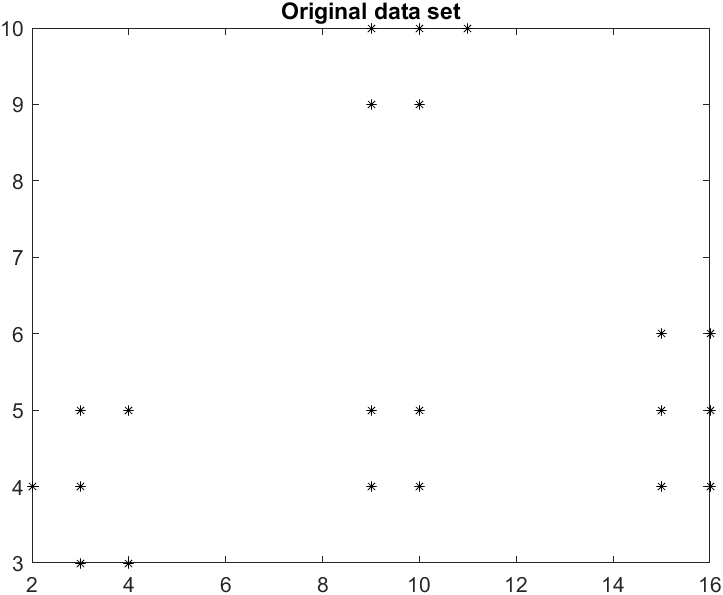

# Explanation

Unsupervised learning is a popular technique used by machine learning scientists. It takes in prepared data and groups them into clusters based on proximity. The closer two data points, the higher the similarity. Data points with close enough similarity are a cluster. Clustering is useful for outlier detection and unsupervised image segmentation. The K-Means algorithm is commonly used. The purpose of this assignment is to create a K-Means algorithm and apply it to two datasets.

## Dataset 1 Original

## Dataset 1 without Normalization

## Dataset 1 with Normalization

## Dataset 2 Original

## Dataset 2 without Normalization

## Dataset 2 with Normalization

